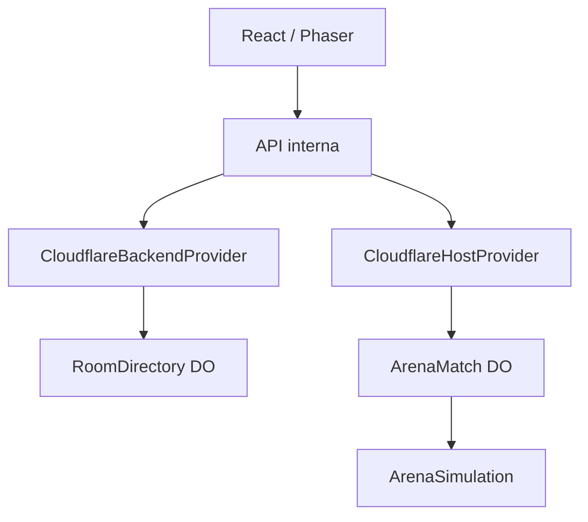

# Arquitetura — CountryBalls Games 0.2.0

## Decisão vigente

O MVP executa inteiramente na Cloudflare. O site e a API compartilham um Worker; cada partida tem um Durable Object autoritativo. A arquitetura comunitária da versão 0.1 continua preservada como provider alternativo, mas não está ativa nesta implantação.

O jogo puro termina em `ArenaSimulation`. Ele não conhece Cloudflare, WebSocket, React ou Phaser. A engine desenha snapshots e captura controles; somente o servidor transforma intenção em estado.

## Componentes

| Componente | Responsabilidade | Não faz |
|---|---|---|
| `apps/web` | catálogo, perfil local, salas, HUD, input e renderização | física ou autorização |
| `CloudflareBackendProvider` | API de sala atrás de uma interface interna | regras da Arena |
| `CloudflareHostProvider` | cria a conexão de partida | interpreta física |
| Worker | roteamento, validação HTTP, assets e limites de borda iniciais | loop de todas as partidas |
| `RoomDirectory` | IDs/códigos, listagem pública, TTL e rate limit | snapshots ou colisão |
| `ArenaMatch` | ticket, sockets, tick, protocolo e broadcast | renderização |
| `ArenaSimulation` | movimento, colisão, ataque, HP, respawn, placar e vitória | IO ou SDK externo |

Há um `ArenaMatch` por `room.id`. Isso isola falhas e estado entre salas e permite que a Cloudflare posicione cada partida. O diretório é um objeto global simples para este MVP; sharding por região será necessário se a escala justificar.

## Fluxo de uma partida

1. frontend chama o provider para criar ou entrar numa sala;
2. Worker valida os dados e pede uma admissão temporária ao `ArenaMatch`;
3. navegador abre WebSocket com ticket aleatório de uso único e 20 segundos de validade;
4. o Durable Object vincula a identidade à conexão e adiciona o jogador ao runtime;
5. clientes enviam `INPUT_FRAME` e `CLIENT_COMMAND`;
6. simulação roda a 30 ticks/s e publica snapshots a 15/s;
7. Phaser interpola a apresentação, mas não determina resultados;
8. com todos prontos a rodada começa; após o tempo, termina e aceita revanche.

## Fronteiras substituíveis

Três decisões continuam independentes:

| Eixo | Atual | Alternativas futuras |
|---|---|---|
| Backend | `CloudflareBackendProvider` | community, Supabase, Firebase, dedicado |
| Host de partida | `CloudflareHostProvider` | community, LAN, dedicado |
| Transporte | WebSocket encapsulado por `MatchClient` | WebRTC, LAN ou outro |

A composição ocorre em `apps/web/src/providers.ts`. Um provider desconhecido falha explicitamente; não há fallback silencioso. Pacotes de jogo não importam providers.

## Tecnologias

- TypeScript estrito, ESM, npm Workspaces e project references.
- React 19 + Vite para a aplicação.
- Phaser 4 para a camada visual 2D, carregado apenas ao entrar na Arena.
- Babylon.js permanece a escolha planejada para 3D, por oferecer mais subsistemas integrados de jogo do que Three.js; ainda não é dependência.
- Worker + Durable Objects SQLite + WebSocket para o host Cloudflare.
- JSON UTF‑8 limitado no protocolo 1; codec isolado para futura migração binária.
- `node:test` para regras e contratos.

## Segurança e privacidade

- navegador nunca recebe credencial administrativa;
- tickets aleatórios são temporários e consumidos uma vez;
- salas privadas não aparecem no diretório e usam código opaco;
- IP não entra nos DTOs nem nos logs da aplicação; uma impressão SHA‑256 curta é usada somente no rate limit temporário;
- tamanho, estrutura, versão, sequência, frequência e semântica das mensagens são validados;
- cliente manda direção/ataque, nunca posição/dano/pontuação;
- CSP, `nosniff`, política de permissões e isolamento de opener são enviados nos assets;
- resultados ainda são casuais: não existe ranking global confiável nesta versão.

## Limitações conscientes

- WebSocket usa a API padrão do Durable Object; uma conexão aberta mantém o objeto ativo e impacta duração/custo.
- Não há retomada de ticket/sessão após queda na variante Cloudflare.
- O diretório global não mede ping real nem faz matchmaking automático.
- O frontend interpola snapshots, mas ainda não implementa prediction/reconciliation.
- O rate limit interno reduz flood simples; WAF/Turnstile e proteção operacional ainda são necessários antes de grande divulgação.
- Persistência atual é de salas e tickets, não de conta, amigos ou ranking.

## Evolução sem reescrever jogos

Adicionar outro jogo significa fornecer manifesto, validadores e runtime headless, além de uma cena de apresentação. Adicionar infraestrutura significa implementar os providers/transportes e selecionar a composição. Em ambos os casos, `ArenaSimulation` permanece inalterada.
