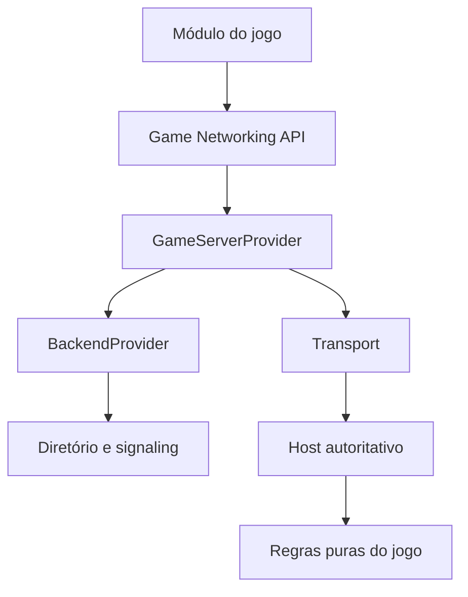

# Arquitetura — CountryBalls Games

Decisão de base: 0.1.0, Fase 1. Esta arquitetura fixa fronteiras estáveis; detalhes de runtime e desempenho serão ajustados por medições sem acoplar jogos à infraestrutura.

## 1. Objetivo e alcance

Um catálogo web/PWA de jogos 2D e 3D. Na primeira versão jogável, apenas CountryBalls Arena 2D, de 2 a 8 jogadores. Cada participante conversa com um host comunitário autoritativo. Não há malha de simulação entre jogadores e nenhum backend comercial executa partidas nesta etapa.

A entrega atual implementa contratos e políticas, não a meta multiplayer completa. A ordenação de hosts e o domínio de salas já têm testes porque determinam as interfaces; os serviços e as telas correspondentes continuam nas fases planejadas.

## 2. Três escolhas independentes de infraestrutura

| Eixo | Responsabilidade | Implementação de referência | Evolução |
|---|---|---|---|
| BackendProvider | Diretório, identidade, salas, convites e seleção de hosts | CommunityBackendProvider + gateway em memória | Gateway HTTPS/WS, Cloudflare, VPS ou outros |
| GameServerProvider | Criar partida, obter admissão, estabelecer uma sessão de jogo | CommunityHostProvider com TransportFactory injetada | Host oficial, dedicado ou LAN |
| Transport | Entregar bytes em canais com semântica definida | Interface; fake apenas em testes | WebRTC, WebSocket, adaptador LAN |

Trocar o diretório não transfere física para esse diretório. Um backend de autenticação/banco de dados não é automaticamente um runtime de partidas. Um provider novo deverá satisfazer as capacidades de execução exigidas, ou rejeitar a configuração de modo explícito.



O servidor autoritativo executa GameRuntime. A renderização não existe no processo de simulação. Cliente envia intenção; servidor aplica velocidades, colisões, cooldown, dano, respawn, pontuação e vitória. O contrato define essa direção; a física será implementada nas fases 5 e 6.

## 3. Tecnologias escolhidas

| Componente | Escolha | Motivo e limite |
|---|---|---|
| Linguagem compartilhada | TypeScript estrito, ESM | Tipagem verificável e simulação independente de engine |
| Organização | npm Workspaces + referências TypeScript | Pouca ferramenta, build por módulo e lockfile único |
| Testes | node:test e assert | Sem runtime adicional para testar regras e protocolos |
| Interface futura | React + Vite | Shell da plataforma separado das engines |
| 2D futuro | Phaser | Renderização, áudio, input e animação; sem regras dependentes da engine |
| 3D futuro | Babylon.js | Recursos integrados de cena, câmeras, áudio, colisões e integração com física |
| Host desktop | Node.js 24; empacotamento Electron | Mesmos módulos JS, operação nativa no Windows, sem VM |
| Coordenador de rede | Node.js, HTTPS + WebSocket | Somente controle; adaptável a outro serviço |
| Transporte preferido | WebRTC DataChannel | Comunicação cliente-host, com ICE e possibilidade de relay |
| Android planejado | Kotlin + serviço foreground + libwebrtc + runtime JS isolado | Exige prova de integração e testes térmicos antes do APK |

Babylon.js foi escolhido em vez de Three.js para reduzir a quantidade de subsistemas de jogo a integrar. Isso não exige mover a física para a engine de renderização. A implementação 3D só começa depois da estabilidade da Arena. Recursos de engine disponíveis constam nas [especificações oficiais do Babylon.js](https://www.babylonjs.com/specifications/).

Electron permite separar processos de interface e tarefas auxiliares; a distribuição poderá incorporar o runtime. A decisão de processo deve seguir o [modelo de processos do Electron](https://www.electronjs.org/docs/latest/tutorial/process-model). Nenhum executável é produzido nesta fase.

## 4. Repositório

```text
apps/
  web/                     contrato da interface e critérios da PWA
  community-server/        plano do aplicativo Windows/Node
  coordinator/             contrato HTTP/WS e implantação futura
  android-server/          plano nativo, serviço e prova técnica
packages/
  shared-types/            DTOs públicos, IDs, relógio, erros
  config/                  configuração e versões
  protocol/                codec, validação e limites por participante
  backend-interface/       BackendProvider, CommunityGateway, AdmissionAuthority
  transport-interface/     Transport, TransportFactory, SignalingChannel
  game-core/               manifesto, GameModule, GameRuntime, checkpoint
  network-core/            GameServerProvider, CommunityHostProvider, reconexão
  host-core/               capacidade, política de benchmark, telemetria
  matchmaking/             ordenação de hosts sem IO
  community-provider/      provider e coordenador em memória
 games/
  arena-2d/                manifesto, regras, inputs e formato de snapshot
 tests/                    contratos e políticas
 tools/                    demonstração e bots sintéticos
 scripts/                  verificação de fronteiras
```

`games/kart-3d`, `football`, `party` e `packages/ui` serão criados quando houver implementação concreta. Não há pacotes vazios fingindo jogos disponíveis. Cada pasta de aplicativo tem documentação; ainda não é um aplicativo executável.

Imports entre pacotes usam `@countryballs/...`. O verificador de fronteiras percorre a AST TypeScript e rejeita imports não declarados ou relativos atravessando pacotes. Os núcleos não importam SDKs externos. Engines entram em módulos de apresentação próprios, com fronteiras adicionadas conscientemente.

## 5. Interfaces principais

| Interface | Operações essenciais | Onde |
|---|---|---|
| BackendProvider | login/logout, hosts, heartbeat, salas, convites, perfil, estatísticas, matchmaking | backend-interface |
| CommunityGateway | Operações autenticadas do coordenador, sem armazenar sessão no jogo | backend-interface |
| AdmissionAuthority | consumeTicket, markDisconnected, resume, setRoomStatus | backend-interface |
| GameServerProvider | createMatch, joinMatch | network-core |
| MatchConnection | sendInput, sendReliableEvent, subscribe, onState, stats, leaveMatch | network-core |
| Transport | connect, send, subscribe, onState, stats, close | transport-interface |
| GameModule | manifest, validateInput, validateCommand, createRuntime | game-core |
| GameRuntime | addPlayer, removePlayer, acceptInput, acceptCommand, step, snapshot, dispose | game-core |
| MessageCodec | encode, decode | protocol |

Interfaces completas estão no código. `saveStats` e `getLeaderboard` falham com `UNSUPPORTED_FEATURE`, pois não há persistência nem ranking confiável. Stubs nunca devolvem sucesso fictício.

## 6. Autoridade e alocação

O coordenador reserva uma vaga de partida; o host confirma a criação real na Fase 3. Uma vaga de jogador é reservada antes de emitir ticket. A admissão usa ticket temporário vinculado ao host, sala e jogador e consumido uma vez.

Nesta referência, o coordenador e o host são chamadas em memória. Não há confirmação de worker real. Em produção, `createRoom` deve usar saga curta: reservar → enviar alocação ao host → confirmar → divulgar. Falha/timeout desfaz a reserva; idempotência evita duplicação em retries. Os testes atuais provam atomicidade somente no processo único, sem `await` na seção de reserva; um adaptador distribuído precisará de transação/compare-and-swap ou proprietário único por host.

Capacidade total limita qualquer combinação de salas. Reserva do dono protege slots que convidados não podem consumir. Salas privadas criadas por convidados usam o pool comunitário; salas privadas criadas pelo aplicativo do dono podem usar capacidade reservada. O nome `publicMatches` no DTO é a ocupação do pool comunitário, inclusive salas privadas de convidados. Quantidade de salas visíveis é outra informação.

## 7. Ciclos e tempo

- Host: desligado → teste → registro → online → drenando → desligado.
- Sala: lobby → running → ended → lobby. A referência exige dois jogadores admitidos para iniciar.
- Jogador: reservado → conectado → desconectado → reservado novamente por resume → conectado.
- Sem reconexão no prazo: liberar vaga, encerrar a sessão local e oferecer voltar ao lobby.
- Host ausente: remover do diretório por lease; partidas que já tinham conexão podem continuar se só o coordenador caiu. O desaparecimento do host real é detectado no transporte.

Relógio injetado permite testes. Prazo de heartbeat considera o recebimento pelo coordenador, nunca o relógio fornecido pelo host. `sweep()` remove expirados a cada operação na referência; o serviço de rede deve também executar varredura periódica.

## 8. Riscos técnicos e decisões

| Risco | Decisão |
|---|---|
| CGNAT, NAT simétrico ou firewall | STUN não garante conexão; provisionar TURN para cobertura ampla |
| Privacidade de IP versus conexão direta | Diretório não publica IP. Peers diretos podem descobrir endereço; relay-only quando isso não for aceitável |
| Custo de TURN | Controlar orçamento, quotas e métricas; não prometer internet multiplayer com custo zero |
| Host modifica software | Partidas casuais; assinatura do app não torna resultado confiável |
| Notebook dorme, celular aquece | Drenar ou reduzir admissão; desconectar com prazo; não forçar mínimo |
| Benchmark CPU artificial | Medir carga representativa por jogo, com 8 jogadores e serialização; calibrar limites |
| Android em segundo plano | Serviço explícito, notificação e controles do usuário; runtime nativo requer prova técnica |
| Electron minimizado | Testar timer/worker/RTC em segundo plano e suspensão; não assumir estabilidade por configuração |
| Rede diferente entre jogadores | Ping é por jogador-host; valores desconhecidos aparecem como desconhecidos |
| Troca de cloud | Separar controle, execução e transporte; validar capacidades do novo runtime |
| Mensagens inválidas ou replay | Validar no ingresso, aplicar quotas e deduplicação; regras do jogo validam semântica |
| Migração prematura | Checkpoint tipado, sem migração automática agora |
| Partidas heterogêneas | Futuro agendamento por custo de jogo, não apenas contagem uniforme de salas |

STUN/TURN e signaling são partes distintas da conexão. A documentação [WebRTC: peer connections](https://webrtc.org/getting-started/peer-connections) descreve a troca de descrições e candidatos. A opção `iceTransportPolicy: "relay"` limita os candidatos usados a relays; ver [RTCPeerConnection](https://developer.mozilla.org/en-US/docs/Web/API/RTCPeerConnection/RTCPeerConnection).

## 9. Frontend e identidade visual planejados

Shell responsivo em português: Início, Jogos, Jogar, Servidores, Amigos, Perfil e Configurações. Arena é a única experiência jogável planejada para o primeiro marco; jogos futuros aparecem como “Em desenvolvimento”, sem botão enganoso.

Direção visual: arena esportiva de CountryBalls, fundo azul-escuro, contraste alto, acentos verde/amarelo, personagens circulares próprios. A tela principal favorece catálogo e entrar numa partida, sem landing publicitária. Ping não medido deve aparecer como “Medindo…” ou “—”, nunca como número inventado.

Servidores: região, versão, carga, slots e ping local. Filtro privado abre busca por código, não uma listagem de salas privadas. Amigos e perfil persistente serão explicitamente indisponíveis até terem implementação. No celular: joystick à esquerda, ataque à direita, respeito à área segura, rotação e perda de foco.

## 10. Próxima etapa

Implementar runtime mínimo do host e sua supervisão na Fase 2. Gates técnicos de rede, benchmark representativo e Android permanecem explícitos. Esta base não depende de aprovação adicional para escolhas rotineiras de implementação; o roadmap evita que etapas avançadas sejam declaradas prontas sem evidência.
